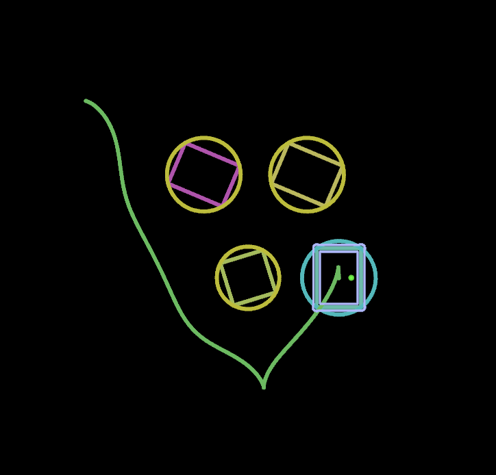

# Mecanum/Differential Drive MPC Trajectory Generation

This project implements a Model Predictive Control (MPC) solution for navigating a robot with either mecanum wheels or a differential drive configuration through an environment with static obstacles.  



## Setup and Installation (using uv)

This project uses `uv` for environment and dependency management.

1.  **Install uv:** If you don't have `uv` installed, follow the instructions [here](https://github.com/astral-sh/uv#installation).

2.  **Create and Sync Environment:** Navigate to the project directory in your terminal and run:
    ```bash
    uv sync
    ```
    This command will create a virtual environment (if it doesn't exist) and install all the dependencies listed in `pyproject.toml`.

## Running the Simulation

To run the simulation, navigate to the project directory in your terminal.

*   **To run with default Mecanum drive kinematics:**
    ```bash
    uv run main.py
    ```

*   **To run with Differential drive (Tank) kinematics:**
    ```bash
    uv run main.py --differential-drive
    ```

## Modeling Approach

The trajectory generation is based on the following modeling principles:

1.  **Wheel Constraints:** Each of the four wheels has defined maximum velocity and acceleration limits.
2.  **Drive Kinematics:** Based on the selected drive type (`mecanum` or `differential-drive`), the individual wheel velocities are translated into the robot's body twist (linear velocities \(v_x, v_y\) and angular velocity \(v_\theta\)) using the appropriate kinematic model.
3.  **SE(2) Integration:** The robot's pose (position \(x, y\) and orientation \(\theta\)) at each time step is determined by integrating the calculated body twist forward in time using SE(2) matrix exponentiation. This ensures consistency with motion respecting the discritization effects caused by running in discrete time intervals.  
4.  **Optimization:** The Model Predictive Controller (MPC) optimizes the sequence of wheel accelerations over the prediction horizon to minimize a cost function (primarily based on minimizing the error to the goal pose and control effort) while respecting the wheel constraints, kinematic model, and obstacle avoidance constraints.


